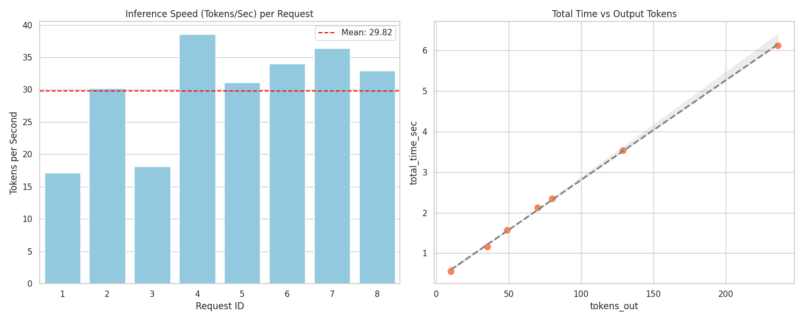

# HalaAI

HalaAI is a local LLM hub that keeps a high-performance model running on a Mac Studio (Apple Silicon) and lets multiple apps tap into it on demand. The server stays alive, manages GPU access, and exposes HTTP and WebSocket APIs for low-latency chat, streaming, and agent workflows.

## Vision

Build a private, always-on "LLM operating system" where one central engine powers many spokes: UIs, agents, and analysis tools. The heavy model loads once, stays warm, and swaps specialized LoRA adapters without reloading the base weights.

## Tech Stack

- Hardware: Mac Studio M4 (unified memory).
- Inference: MLX via `mlx-lm` for bare-metal Apple Silicon performance.
- Server: FastAPI with HTTP + WebSocket endpoints.
- Orchestration: LangChain agents via a custom local LLM wrapper.
- UI: Chainlit web chat.
- Data: SQLModel + SQLite logging; Pandas used for metrics analysis.

## Model Setup

- Base model: `mlx-community/Qwen2.5-14B-Instruct-4bit`.
- Quantization: 4-bit to fit in local memory.
- Adapters: LoRA personalities stored in `adapters/` and hot-swapped at runtime.

## Architecture

```
Spokes (UI, agents, tools)
        |
        v
FastAPI server (HTTP + WebSocket)
        |
        v
ModelEngine singleton (MLX)
        |
        +--> LoRA adapters (hot swap)
        +--> Deep Search (Brave + Browse)
        +--> Session DB (Postgres) + VectorDB (Chroma)
        +--> SQLite logs + hardware monitor
```

Key behaviors are implemented in:
- `app/engine.py` for the singleton engine, adapter swapping, and GPU lock.
- `app/ws_chat.py` for streaming WebSocket responses.
- `app/prompts.py` for the system prompt, tool protocol, and search context formatting.
- `app/session_manager.py` for session persistence + summarisation + sweeper.
- `app/database.py` for inference logs.
- `app/monitor.py` for hardware stats polling.
- `app/queue.py` for the custom priority queue that feeds the GPU worker.
- `core/search/brave_browse.py` for Brave Search + page scraping.
- `core/search/browser.py` for text extraction (Trafilatura-based).
- `data/sql/database.py` for the Postgres-backed sessions table.
- `data/sql/expander.py` for expanding full transcripts by UUID.

## Quickstart

1) Install dependencies:

```bash
python3 -m pip install -r requirements.txt
```

2) Start the FastAPI server:

```bash
python3 run_server.py
```

When the server starts you should see logs for the queue worker and monitor:

```
Started background queue worker.
Started queue monitor.
Queue status | depth=0 ...
```

3) (Optional) Start the Chainlit UI on a different port:

```bash
cd ui
CHAINLIT_PORT=8001 python3 -m chainlit run app.py -w
```

If your server runs elsewhere, set:

```bash
HALA_WS_URL=ws://localhost:8000/ws/chat/v2
```

History DB connection (optional override):

```bash
HALA_HISTORY_DB_URL=postgresql://USER@localhost:5432/hala_ai_history
```

## API Overview

HTTP:
- `GET /` health check (returns current adapter).
- `POST /chat` blocking generation.
- `POST /adapters/load` hot-swap LoRA adapters.

WebSocket:
- `ws://localhost:8000/ws/chat/v2` for streaming tokens.

Data APIs:
- `GET /data/sessions` list all chat sessions (Postgres).
- `GET /data/session?session_id=<uuid>` fetch a single session.
- `POST /data/vector/search` semantic search over the vector DB.

Example request:

```bash
curl -X POST http://localhost:8000/chat \
  -H "Content-Type: application/json" \
  -d '{"prompt":"Hello","max_tokens":256,"priority":10}'
```

WebSocket payloads should include `session_id` so history is stored per chat.
The UI sends `{"type": "session_start"}` on open and `{"type": "session_end"}` on close.
If you want session logging but do **not** want history injected into the prompt,
set `include_history: false` on each request.

### Priority Queue

- All requests flow through `app/queue.py`, a priority queue (lower number = higher priority) with optional starvation prevention.
- The background worker in `app/engine.py` consumes from the queue and streams tokens back via WebSocket/HTTP response queues.
- Client payloads can include `priority`; if omitted, the default from `settings.priorities.standard` is used. Examples:
  - HTTP: `{"prompt":"...", "priority": 1}`
  - WebSocket v2: `{ "prompt": "...", "priority": 5 }`
- Queue health is logged periodically as `Queue status | depth=...` when running `python3 run_server.py`.

## Adapters

- Adapters live in `adapters/`.
- Use `adapter_name="default"` to load a single adapter stored directly in `adapters/`.
- Use `adapter_name="<folder>"` to load a named adapter in `adapters/<folder>/`.
- Use `adapter_name="base"` or `adapter_name="none"` to unload to the base model.

Example:

```bash
curl -X POST http://localhost:8000/adapters/load \
  -H "Content-Type: application/json" \
  -d '{"adapter_name":"default"}'
```

## Performance and Evals

### Performance

- Avg ~29.8 tokens/sec with peaks around ~38 t/s for the 14B model.
- Roughly 4x human reading speed (~5-8 tokens/sec).
- Total time vs tokens-out is linear, indicating stable throughput as responses get longer.



### Evals

- Report: `evals/results/eval_report_golden_general_20251223_170911.md`
- Dataset: `evals/datasets/golden_general.jsonl` (max tokens: 200)
- Base model: 41/50 keyword hits (82.0%)
- Tuned adapter: 39/50 keyword hits (78.0%)

## Streaming UI (Chainlit)

See `ui/chainlit.md` for detailed UI setup. The UI connects to `ws://localhost:8000/ws/chat/v2` and streams tokens into the chat pane.

## LangChain Integration

Use `examples/langchain/HalaLLM.py` to plug the local hub into LangChain as a custom LLM provider. The sports agent example is in `examples/langchain/sports_agent.py`.

## Logging and Monitoring

- Logs are stored in `inference_logs.db` via SQLModel.
- Hardware stats are polled in `app/monitor.py`.
- For GPU stats on macOS, install macmon:

```bash
brew install vladkens/tap/macmon
```

## Evals

Lightweight evaluation scripts live in `evals/`.

```bash
python evals/runners.py
python evals/runners.py --dataset evals/datasets/golden_general.jsonl
```

## Testing

Queue-specific unit tests live in `tests/test_queue.py`. Run them with:

```bash
python -m unittest discover -s tests -p "test_*.py"
```

These cover priority ordering, starvation prevention, queue capacity overflow, blocking dequeue, and stats snapshots.

## Debugging (WebSocket Path, VS Code)

1) Start the FastAPI server with debugpy:

```bash
python -m debugpy --listen 5678 --wait-for-client run_server.py
```

2) Start Chainlit in another terminal:

```bash
cd ui
CHAINLIT_PORT=8001 python3 -m chainlit run app.py -w
```

3) In VS Code, run the "Attach FastAPI (debugpy)" configuration from `.vscode/launch.json`.

Suggested breakpoints:
- `app/ws_chat.py`: `websocket_chat`, before/after memory recall.
- `app/queue.py`: `enqueue`, `dequeue`.
- `app/engine.py`: `generate_stream`, `_worker_loop`.

## Project Layout

- `app/` FastAPI server, engine, WebSocket handlers, logging, monitoring.
- `ui/` Chainlit chat client.
- `examples/` API, WebSocket, and LangChain integration samples.
- `adapters/` LoRA adapter weights and config.
- `evals/` evaluation scripts and reports.
- `data/` vector DB, SQL helpers, data services, and datasets.
- `performance/` performance logs and plots.

## Performance Notes

Local tests on the Mac Studio M4 show:
- ~30 tokens/sec streaming throughput.
- Adapter fine-tuning retained personal facts without degrading general reasoning in the "golden dataset" checks.

## Deep Search + Browsing (Brave)

HalaAI supports a "deep search" flow that automatically searches the web and scrapes the top results. The LLM triggers search by emitting:

```
[SEARCH: <query>]
```

What happens next:
1) `app/ws_chat.py` runs a short search-intent probe to detect a `[SEARCH: ...]` command.
2) `core/search/brave_browse.py` calls the Brave Web Search API and scrapes the top results.
3) Scraped text is attached to each result object as `content` (up to 25,000 chars per page).
4) `app/prompts.py` formats a "Deep Search Results" block and injects it into the system prompt.
5) The LLM answers using the supplied sources.

### Scraping Notes

- `core/search/browser.py` uses Trafilatura to extract clean page text.
- JS-heavy pages that fail extraction are skipped.
- Wikipedia results are prioritised when present.

### Prompting

- The system prompt is assembled in `app/prompts.py`.
- It includes persona, tool protocol, exact local date/time, and (optionally) system-verified user profile + search results.
- If no search data is available, the LLM is instructed to emit a `[SEARCH: ...]` command.

## Session Memory + Summaries

HalaAI maintains both short-term chat history and long-term summaries:

- **Live chat history**: each message is appended to Postgres (`sessions.history`).
- **Summaries**: when a session closes (or goes idle), a summary/title is generated and stored in Postgres.
- **VectorDB**: summaries are embedded into Chroma (`source="chat_summary"`) for semantic recall.

### Session lifecycle (WebSocket)

1) Chainlit generates a `session_id` on chat start and sends `{"type": "session_start"}`.
2) Each message includes `session_id` and is appended to `sessions.history`.
3) On UI close, `{"type": "session_end"}` triggers summarisation.
4) A background sweeper runs every 30 minutes and auto-closes sessions idle for ~10 minutes.

### Resetting data stores

To wipe both Postgres session history and the Chroma vector DB:

```bash
python3 data/reset_datastores.py
```

### Session Expansion

If the model needs full history, it can emit:

```
[EXPAND: <session_uuid>]
```

The server fetches the full transcript from Postgres and injects it into the prompt as
**prior dialogue context**.

## Constraints & Rate Limiting (Brave API)

The Brave API is quota-limited, so HalaAI enforces guardrails:

- Configuration: `config/brave_search_limits.json`
  - `monthly_limit` (default 1000)
  - `billing_day` (billing cycle start day of month)
  - `daily_limit_strategy` (`"remaining_per_day"`)
- Usage state: `config/brave_search_usage.json` (auto-updated)
  - `period_start`, `count`, and per-day counts

Behaviour:
- Only successful HTTP 200 responses increment usage.
- A rolling daily budget is computed from remaining quota and days in the billing period.
- When the monthly or daily budget is exhausted, the search tool returns an error string
  instead of calling the API.

Operational target:
- Aim for ~30 Brave requests per day to stay well under the 1,000/month cap.

## Data Services (API)

List sessions:

```bash
curl -s http://localhost:8000/data/sessions
```

Fetch a session:

```bash
curl -s "http://localhost:8000/data/session?session_id=YOUR_UUID"
```

Vector search:

```bash
curl -X POST http://localhost:8000/data/vector/search \
  -H "Content-Type: application/json" \
  -d '{"query":"recent chat about football","n_results":5,"threshold":1.2,"where":{"source":"chat_summary"}}'
```
